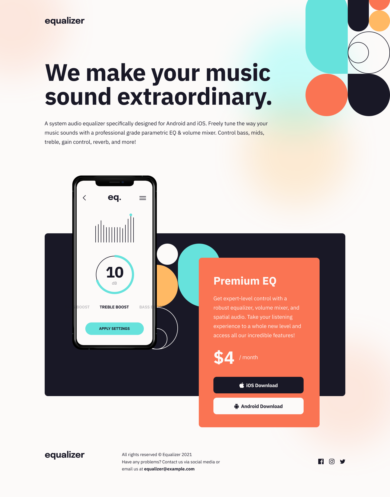

# Frontend Mentor - Equalizer landing page solution

This is a solution to the [Equalizer landing page challenge on Frontend Mentor](https://www.frontendmentor.io/challenges/equalizer-landing-page-7VJ4gp3DE). Frontend Mentor challenges help you improve your coding skills by building realistic projects. 

## Table of contents
- [Overview](#overview)
    - [The challenge](#the-challenge)
    - [Screenshot](#screenshot)
    - [Links](#links)
    - [Author](#author)

## Overview

### The challenge

Users should be able to:

- View the optimal layout depending on their device's screen size
- See hover states for interactive elements

### Screenshot

### Links
- [Solution] (https://github.com/vidhitvarma/Frontend-Mentor-Projects/tree/main/equalizer-landing-page)
- [Live] (https://equalizer-landing-page-vivarma.netlify.app/)

## Author
- Github - [Vidhit Varma] (https://github.com/vidhitvarma)
- Frontend Mentor - [Vidhit Varma] (https://www.frontendmentor.io/profile/vidhitvarma)