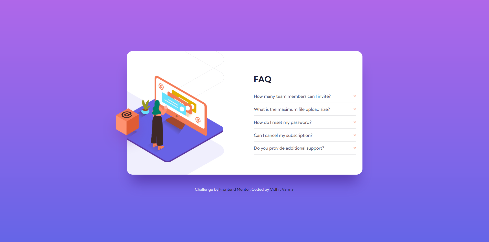

# Frontend Mentor - FAQ accordion card solution

This is a solution to the [FAQ accordion card challenge on Frontend Mentor](https://www.frontendmentor.io/challenges/faq-accordion-card-XlyjD0Oam). Frontend Mentor challenges help you improve your coding skills by building realistic projects. 

## Table of contents
- [Frontend Mentor - FAQ accordion card solution](#frontend-mentor---faq-accordion-card-solution)
  - [Table of contents](#table-of-contents)
  - [Overview](#overview)
    - [The challenge](#the-challenge)
    - [Screenshot](#screenshot)
    - [Links](#links)
  - [Author](#author)

## Overview

### The challenge

Users should be able to:

- View the optimal layout for the component depending on their device's screen size
- See hover states for all interactive elements on the page
- Hide/Show the answer to a question when the question is clicked

### Screenshot

### Links
- [Solution] (https://github.com/vidhitvarma/Frontend-Mentor-Projects/tree/main/faq-accordion-card-main)
- [Live] (https://faq-accordion-vivarma.netlify.app/)

## Author
- Github - [Vidhit Varma] (https://github.com/vidhitvarma)
- Frontend Mentor - [Vidhit Varma] (https://www.frontendmentor.io/profile/vidhitvarma)