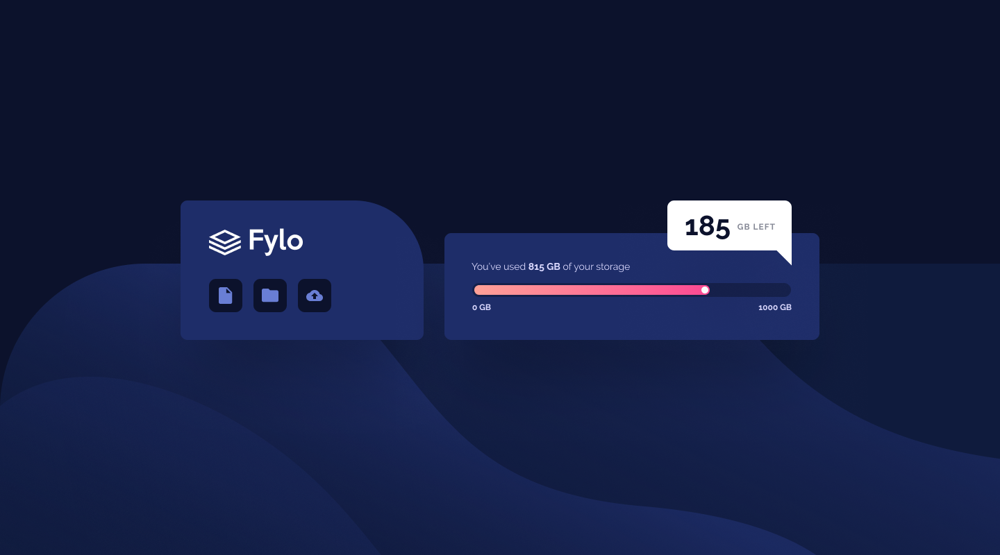

# Frontend Mentor - Fylo data storage component solution

This is a solution to the [Fylo data storage component challenge on Frontend Mentor](https://www.frontendmentor.io/challenges/fylo-data-storage-component-1dZPRbV5n). Frontend Mentor challenges help you improve your coding skills by building realistic projects. 

## Table of contents
- [Overview](#overview)
    - [The challenge](#the-challenge)
    - [Screenshot](#screenshot)
    - [Links](#links)
    - [Author](#author)

## Overview

### The challenge

Users should be able to:

- View the optimal layout for the site depending on their device's screen size

### Screenshot

### Links
- [Solution] (https://github.com/vidhitvarma/Frontend-Mentor-Projects/tree/main/fylo-data-storage-component-master)
- [Live] (https://fylo-data-storage-component-vivarma.netlify.app/)

## Author
- Github - [Vidhit Varma] (https://github.com/vidhitvarma)
- Frontend Mentor - [Vidhit Varma] (https://www.frontendmentor.io/profile/vidhitvarma)