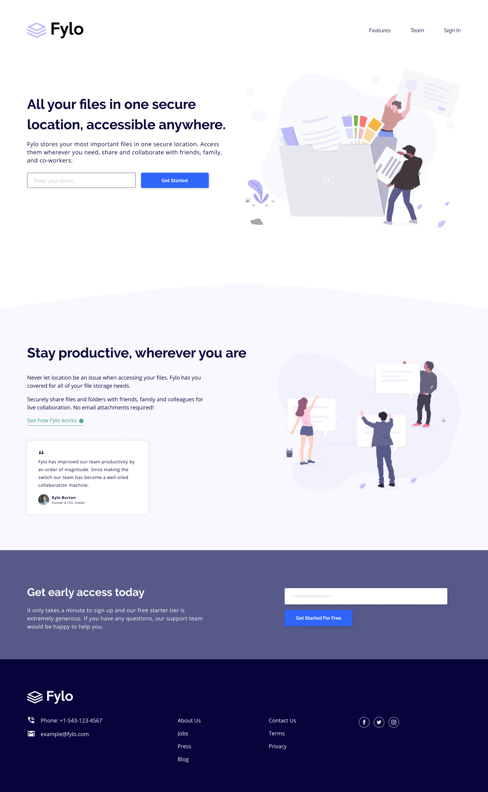

# Frontend Mentor - Fylo landing page with two column layout solution

This is a solution to the [Fylo landing page with two column layout challenge on Frontend Mentor](https://www.frontendmentor.io/challenges/fylo-landing-page-with-two-column-layout-5ca5ef041e82137ec91a50f5). Frontend Mentor challenges help you improve your coding skills by building realistic projects. 

## Table of contents
- [Frontend Mentor - Fylo landing page with two column layout solution](#frontend-mentor---fylo-landing-page-with-two-column-layout-solution)
  - [Table of contents](#table-of-contents)
  - [Overview](#overview)
    - [The challenge](#the-challenge)
    - [Screenshot](#screenshot)
    - [Links](#links)
  - [Author](#author)

## Overview

### The challenge

Users should be able to:

- View the optimal layout for the site depending on their device's screen size
- See hover states for all interactive elements on the page

### Screenshot

### Links
- [Solution](https://github.com/vidhitvarma/Frontend-Mentor-Projects/tree/main/fylo-landing-page-with-two-column-layout-master)
- [Live](https://fylo-landing-page-two-col-vivarma.netlify.app/)

## Author
- Github - [Vidhit Varma](https://github.com/vidhitvarma)
- Frontend Mentor - [Vidhit Varma](https://www.frontendmentor.io/profile/vidhitvarma)